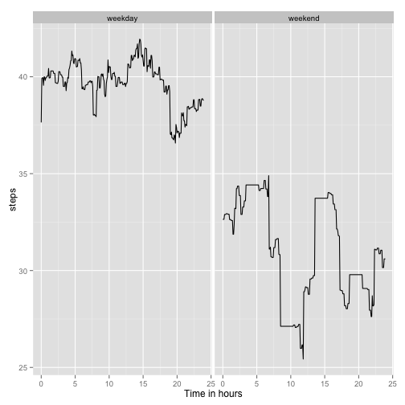

# Reproducible Research: Peer Assessment 1

## Introduction

It is now possible to collect a large amount of data about personal movement using activity monitoring devices such as a Fitbit, Nike Fuelband, or Jawbone Up. These type of devices are part of the “quantified self” movement – a group of enthusiasts who take measurements about themselves regularly to improve their health, to find patterns in their behavior, or because they are tech geeks. But these data remain under-utilized both because the raw data are hard to obtain and there is a lack of statistical methods and software for processing and interpreting the data. This assignment makes use of data from a personal activity monitoring device. This device collects data at 5 minute intervals through out the day. The data consists of two months of data from an anonymous individual collected during the months of October and November, 2012 and include the number of steps taken in 5 minute intervals each day.

==================================================================================
Loading and pre-processing the data

```r
#Load activity data
activity = read.csv("activity.csv")
```


## What is mean total number of steps taken per day?

```r
# aggregate total steps per day
daily_steps = aggregate(activity["steps"], by=activity["date"], FUN=sum, na.rm=TRUE)
steps_dist = daily_steps[,"steps"]
hist(steps_dist)
```

 

```r
avg_steps = mean(steps_dist,na.rm=TRUE)
median_steps=median(steps_dist,na.rm=TRUE)
```
The average number of steps taken daily by this individual is: 9354.2295

The median number of steps taken daily by this individual is: 10395
## What is the average daily activity pattern?

```r
# aggregate average steps per day interval
activity$interval=as.factor(activity$interval)
interval_steps= aggregate(activity["steps"], by=activity["interval"],FUN=mean,na.rm = TRUE)
time=0:287
plot(time*5/60,interval_steps[,"steps"],"l",xlab="Time in hours")
```

 

```r
maxi_avg_steps=max(interval_steps[,"steps"],na.rm=TRUE)
highest_int=interval_steps[interval_steps[,"steps"]==maxi_avg_steps,1]
```
The highest activity five minutes interval occurs at 835

## Imputing missing values

```r
# create activity_fitted variable with NA values replaced by average 
# over the days for the interval
merged=merge(activity,interval_steps,by.x="interval",by.y="interval")
activity_fitted=activity
activity_fitted$steps=merged$steps.y

#rename activity to activity_raw and activity_fitted to activity
activity_raw=activity
activity=activity_fitted

#reuse code from part 1 of the assignment

# aggregate total steps per day
daily_steps = aggregate(activity["steps"], by=activity["date"], FUN=sum, na.rm=TRUE)
steps_dist = daily_steps[,"steps"]
hist(steps_dist)
```

 

```r
avg_steps = mean(steps_dist,na.rm=TRUE)
median_steps=median(steps_dist,na.rm=TRUE)
```
The average number of steps taken daily by this individual is: 1.0766 &times; 10<sup>4</sup>

The median number of steps taken daily by this individual is: 8687.5472

## Are there differences in activity patterns between weekdays and weekends?

```r
activity$date=as.Date(activity$date)
activity$DOW=weekdays(activity$date)
activity$DayType = ifelse((activity["DOW"]=="Saturday" | activity["DOW"]=="Sunday") ,"weekend","weekday")

pattern= aggregate(activity["steps"], by=c(activity["interval"],activity["DayType"]),FUN=mean,na.rm = TRUE)
pattern$time=(as.numeric(pattern$interval)*5-5)/60
library(ggplot2)
qplot(time,steps,data=pattern,facets= ~ DayType,geom="line",xlab="Time in hours")
```

 
